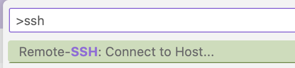

# linkedin_post_scraper

Scraping posts of a company from linkedin and saving them in markdown files.

## Starting the environment

In order to start the environment, open `VScode` and start it in the container. Usually VScode notices that there is a `.devcontainer` and suggests to start the environment in the container.

Once the devcontainers are up & running you can inspect what's going on in the selenium container via [this UI](http://localhost:4444/ui#).

In the terminal launch the scraper with `./linkedin_post_scraper.py`.

## Concepts & structures

* **browser** and **GLOBAL_BROWSER** are variables that hold the selenium browser instance. The GLOBAL_BROWSER is used to keep the browser open after the script has finished, since it might be re-used later. Often this object is called `driver` in other code bases.
* **Containers** are the HTML code that contains the data of one post. From the container I extract text using the *Beautifoul Soup* framework.
* **Blog posts** is what I create. They contain a date, a text, an aiuthor. Since LinkedIn Posts do not have a title, I need to create one myself. I do this by taking the first 10 words of the post and use them as a title. At a later stage generating such titles could be a great AI use case.

## Todos

* React properly if linkedin returns the code-poage when asking to log in
* Add container that re-builds blog if scraper added data

## Problems / Solutions / Readings

### Testing in Python

I followed [this guide](https://realpython.com/python-testing/) and chose to use `pytest` - therefore going thru [this guide](https://realpython.com/pytest-python-testing/) too 😜.

To run all my tests simply call `pytest`.

### Working on a remote host

Following the explanation [Develop on a remote Docker host](https://code.visualstudio.com/remote/advancedcontainers/develop-remote-host) I tried the way called [Connect using the Docker CLI](https://code.visualstudio.com/remote/advancedcontainers/develop-remote-host#_connect-using-the-docker-cli):

* Spun up a machine on AWS (Ubuntu 22.04.3 LTS, t2.xlarge ~ 2 vCPU, 16 GB Mem, 50 GB disk) and gave access to ping, HTTP/S and SSH.
* SSHed onto the machine (`ssh ubuntu@machine_ip`)
* Installed Docker according to [this guide](https://docs.docker.com/engine/install/ubuntu/). 
* Don't forget the steps in [Linux post-installation steps for Docker Engine](https://docs.docker.com/engine/install/linux-postinstall/)!

Once this server is running and accessible, open VScode, connect to the server via ssh in the command menu:

Once you are there, clone the project from Github and go.

Port forfarding takes some attention, but is nicely explainer [here](https://www.heissenberger.at/en/blog/devcontainer-forward-ports-composer/) in context with a docker compose setup.

### Keeping the Terminal history

It's annoying that when you rebuild the containers that make up your dev environment, the bash history gets lost. [Here](https://code.visualstudio.com/remote/advancedcontainers/persist-bash-history) is a way to fix it. It's a bit cumbersome but you only have to set it up once, then it (hopefully) works forever 😜

😢 Did not manage to get this working...

### Installing VScode extensions that survive a rebuild

### Using Selenium from within Docker
Installing Selenium to run within a container is rather tricky, that's why we use a pre-built container from [SeleniumHQ](https://github.com/SeleniumHQ/docker-selenium). We launch the Selenium container and remote-controle the Chromedriver. 
In order to see and understand what is happening in the Selenium container there are 2 perspectives:

* A [VNC terminal](http://localhost:7900/?autoconnect=1&resize=scale&password=secret) in which you see the remote-controlled browser
* A [management console UI](http://localhost:4444/ui) in which you see what _selenium jobs_ are running.

### Chat-GPT in Jupyter

I followed [this guide](https://blog.jupyter.org/generative-ai-in-jupyter-3f7174824862) to get Chat-GPT running in Jupyter.
In order to get it running:

* Start jupyter lab (`jupyter lab` 😜)
* In the left bar select the chat icon at the bottom
* Go in the settings (⚙️ symbol) and select the models and enter your Keys

### Getting the date of posts

LinkedIn seems to do it on purpose to not expose proper structures with proper data. One of the data that is obfouscated is the date when a post was published. The best we seem to get (as of today: 2023-07-10) is the relative date: `1w` means the post is a week old. 
An approach on how to convert this is done [in this Stack Overflow Post](https://codereview.stackexchange.com/questions/129899/scraping-the-date-of-most-recent-post-from-various-social-media-services) - even though bnoth the selectors don't work anymore nowadays, as well as the units: It used to be days/weeks/months, it is now w/mo/y.

### Installing components

To install Chromedriver I followed [this guide](https://www.kenst.com/installing-chromedriver-on-mac-osx/#:~:text=The%20easiest%20way%20to%20install,seeing%20it%20returns%20a%20version.). It basically boils down to `brew install cask chromedriver`. 
**Note**: I couldn't execute it at first as it was forbidden by Apple policies. So I had to `xattr -d com.apple.quarantine /usr/local/bin/chromedriver` to remove the quarantine flag.

To install Selenium for my jupyter notebook I followed [this guide](https://shanyitan.medium.com/how-to-install-selenium-and-run-it-successfully-via-jupyter-lab-c3f50d22a0d4)

To use Chat-GPT within Jupyter I followed this [guide](https://blog.jupyter.org/generative-ai-in-jupyter-3f7174824862)

### LinkedIn Post Scraper

Ideas and code snippets taken from [this repo](https://github.com/christophe-garon/Linkedin-Post-Scraper) and the [blog article](https://christophegaron.com/articles/mind/automation/scraping-linkedin-posts-with-selenium-and-beautiful-soup/) that goes with it. 

Note: This code base uses an old version of Beautifoul Soup, so the syntax is not valid anymore.

